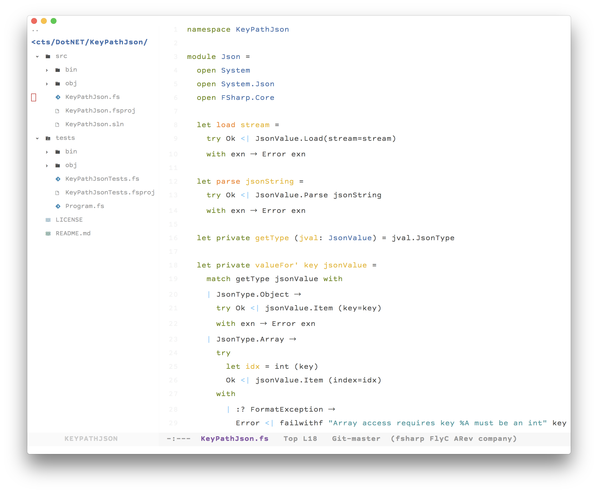

# emacs.d

My relocatable Emacs config with [Cask](https://github.com/cask/cask).



## Usage

Install Cask if you haven't, clone and run `cask`.

## External tools

```sh
opam install merlin tuareg ocp-indent
npm i -g tern prettier

```

### For Java

```sh
brew cask install eclipse-ide
```

Install [eclim](http://eclim.org) to `/Applications/Eclipse.app/Contents/Eclipse` and add its bin dir to `$PATH`.

## For Erlang

``` sh
brew install kerl
echo 'KERL_CONFIGURE_OPTIONS="--disable-hipe --enable-smp-support --enable-threads
                        --enable-kernel-poll --without-odbc --enable-darwin-64bit"' > ~/.kerlrc
kerl build 20.2 20.2
kerl install 20.2 ~/.kerl/20.2

cd ~/.emacs.d
git submodule update --init
cd distel
make
echo 'code:add_pathsz(["~/.emacs.d/distel/ebin"]).' >> ~/.erlang

brew install syntaxerl
```

Add `. ~/.kerl/20.2/activate` to `.zshrc` or `.bashrc`.

## Personal macOS stuff

```sh
brew tap railwaycat/emacsmacport
brew install emacs-mac --with-gnutls --with-natural-title-bar #--HEAD #optional
defaults write org.gnu.Emacs TransparentTitleBar LIGHT
defaults write org.gnu.Emacs HideDocumentIcon YES
```
